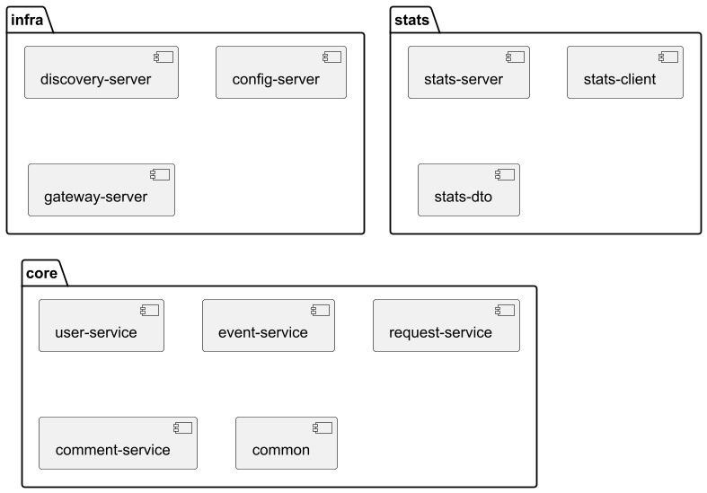

# Описание основной функциональности



## Внутреннее взаимодействие между сервисами
* В модуле <code>core</code> все бизнес-сервисы используют подмодуль <code>common</code>, в который вынесены общие 
классы - dto, исключения, Feign-клиенты, их декодеры, конфиги и фоллбэки
* Подмодуль <code>event-service</code> использует внутренний API подмодулей <code>user-service</code>, <code>request-service</code>, 
<code>comment-service</code>, а также использует <code>stats-client</code> из модуля <code>stats</code>
* Подмодуль <code>request-service</code> использует внутренний API подмодулей <code>user-service</code> и 
  <code>event-service</code>
* Подмодуль <code>comment-service</code> использует внутренний API подмодулей <code>user-service</code> и
  <code>event-service</code>

## Внутренний API

### user-service

#### <code>GET admin/users/{userId}</code>
Получение <code>UserDto</code> с указанным <code>id</code>

#### <code>GET admin/users/short/{userId}</code>
Получение <code>UserShortDto</code> с указанным <code>id</code>

#### <code>GET admin/users/short?ids=...</code>
Получение списка <code>UserShortDto</code> с <code>id</code> из перечня

### event-service

#### <code>GET /events/inner/{eventId}</code>
Получение <code>EventFullDto</code> с указанным <code>id</code>

*Внешний <code>GET</code>-метод получения события возвращает только 
опубликованные события (<code>EventState.PUBLISHED</code>)*

### request-service

#### <code>GET /requests/countConfirmed?eventIds=...</code>
Получение мапы с количеством подтвержденных заявок на участие для событий с <code>id</code> из перечня

### comment-service

#### <code>GET /admin/comments/count?eventIds=...</code>
Получение мапы с количеством комментариев для событий с <code>id</code> из перечня

#### <code>GET /admin/events/{eventId}/comments/count.</code>
Получение количества комментариев для события с указанным <code>id</code>

## Внешний API

[Главный сервис](ewm-main-service-spec.json)

[Сервис статистики](ewm-stats-service-spec.json)

# Фича - комментарии к событиям

## Private

### <code>POST /events/{eventId}/comments</code>

Добавление нового комментария событию.

#### Праметры

* <code>eventId</code> - <code>id</code> события.
* В запросе должен быть заголовок <code>X-Ewm-User-Id</code> с указанием <code>userId</code> пользователя, который оставляет комментарий.

#### Тело

* В <code>body</code> передаётся <code>CommentDto</code> с заполненным полем <code>text</code>.

#### Ответы

* <code>201</code> Комментарий успешно создан, возвращается <code>CommentDto</code> со всеми полями (<code>editedOn = null</code>).
* <code>400</code> Запрос составлен некорректно: не указан заголовок, отсутствует текст комментария, длина комментария не соответствует требованиям.
* <code>404</code> Пользователь или событие не найдены.

### <code>PATCH /events/{eventId}/comments/{commentId}</code>

Изменение комментария пользователем.

#### Параметры

* <code>eventId</code> - <code>id</code> события.
* <code>commendId</code> - <code>id</code> комментария.
* В запросе должен быть заголовок <code>X-Ewm-User-Id</code> с указанием <code>userId</code> пользователя, который редактирует комментарий.

#### Тело

* В <code>body</code> передаётся <code>UpdateCommentRequest</code> с заполненным полем <code>text</code>.

#### Ответы

* <code>200</code> Комментарий успешно изменён, возвращается <code>CommentDto</code> со всеми полями (<code>editedOn != null</code>).
* <code>400</code> Запрос составлен некорректно: не указан заголовок, отсутствует текст комментария, 
длина комментария не соответствует требованиям, комментарий не связан с указанным событием.
* <code>403</code> Нет доступа на редактирование комментария (<code>X-Ewm-User-Id != userId</code>).
* <code>404</code> Комментарий не найден.

### <code>DELETE /events/{eventId}/comments/{commentId}</code>

Удаление комментария пользователем.

#### Параметры

* <code>eventId</code> - <code>id</code> события.
* <code>commendId</code> - <code>id</code> комментария.
* В запросе должен быть заголовок <code>X-Ewm-User-Id</code> с указанием <code>userId</code> пользователя, который удаляет комментарий.

#### Ответы

* <code>204</code> Комментарий успешно удалён.
* <code>400</code> Запрос составлен некорректно: не указан заголовок, комментарий не связан с указанным событием.
* <code>403</code> Нет доступа на удаление комментария (<code>X-Ewm-User-Id != userId</code>).
* <code>404</code> Комментарий не найден.

## Admin

### <code>DELETE /admin/events/{eventId}/comments/{commentId}</code>

Удаление комментария администратором.

#### Параметры

* <code>eventId</code> - <code>id</code> события.
* <code>commendId</code> - <code>id</code> комментария.

#### Ответы

* <code>204</code> Комментарий успешно удалён.
* <code>400</code> Комментарий не связан с указанным событием.
* <code>404</code> Комментарий не найден.

## Public

### <code>GET /events/{eventId}/comments</code>

Получить все комментарии к событию с указанным <code>id</code>.

#### Параметры

* <code>eventId</code> - <code>id</code> события.
* <code>from</code> - количество элементов, которые нужно пропустить для формирования текущего набора.
  * <code>0</code> - значение по умолчанию.
* <code>size</code> - количество элементов в наборе.
  * <code>10</code> - значение по умолчанию.

#### Ответы

* <code>200</code> Массив объектов <code>CommentDto</code>.
* <code>404</code> Событие не найдено.

### Изменение существующих эндпоинтов

* При вызове эндпоинтов получения событий в возвращаемые <code>dto</code> добавлены поля с количеством комментариев к событию.

## Модель данных

### <code>CommentDto</code>

```json
{
  "id": 1,
  "text": "текст комментария",
  "userId": 2,
  "eventId": 3,
  "createdOn": "2022-09-06T21:10:05.432",
  "editedOn": null
}
```

В поле <code>editedOn</code> устанавливается последняя дата редактирования комментария.

### <code>UpdateCommentRequest</code>

```json
{
  "text": "текст комментария"
}
```